<div align="center">


# Chowk

**Sell it. Find it. Around the corner.**

A free marketplace for India where anyone can sell, give away, swap or ask for things near them.

[](https://chowk-kandula.vercel.app)
[](https://nextjs.org)
[](https://supabase.com)
[](LICENSE)

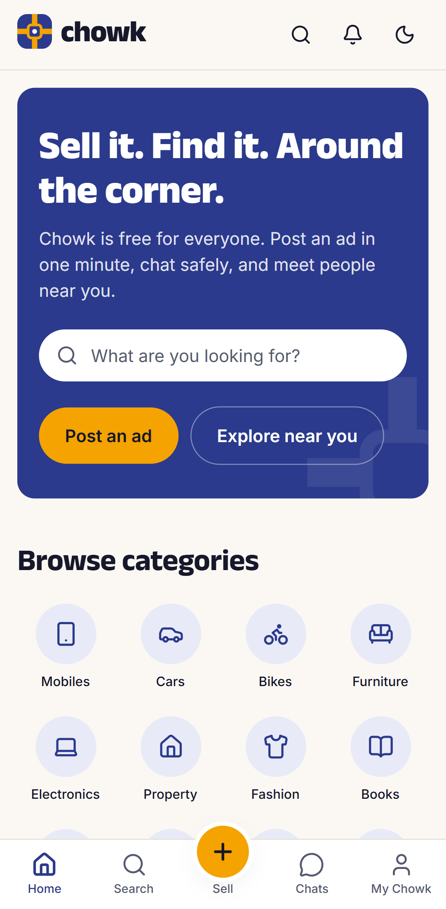
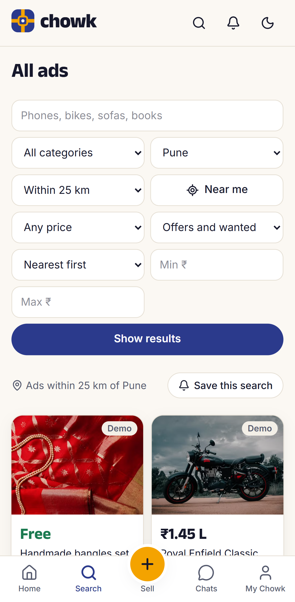
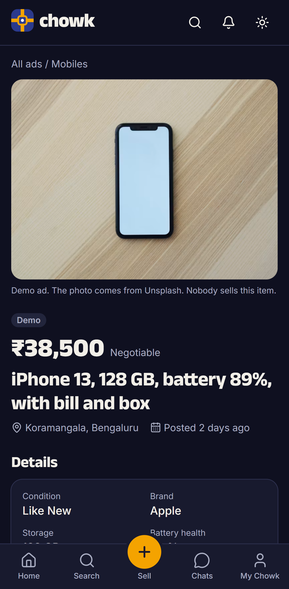

</div>

## Why Chowk

India has general classifieds and many vertical apps. People still meet the same problems: fake buyers, "courier fee" and UPI QR scams, spam, and city-wide results that ignore how far away an item is.

Germany's Kleinanzeigen shows another model: free ads, radius search, wanted ads, give-away culture, saved-search alerts, and trust badges that come only from real deals. Chowk brings that model to India and adds safety features for Indian payment scams.

- **Free for everyone.** No listing fees, no paid boosts, no commission. Chowk never holds money.
- **Near you.** Radius search from 2 to 100 km around a city or your location, sorted nearest first.
- **Safe by default.** Scam warnings inside the chat, a UPI pay link only after both people meet, and reports and blocks.
- **Trust you can see.** Friendly and reliable badges from confirmed deals. Guest ratings do not count.

## Features

### Kleinanzeigen parity

| Kleinanzeigen | Chowk |
|---|---|
| Anzeige aufgeben | Post in 2 steps: photos first (up to 12), then details. The draft saves on the device. |
| Angebot and Gesuch | Offer and Wanted ads |
| Festpreis, VB, Zu verschenken, Tauschen | Fixed, Negotiable, Free and Swap prices |
| Categories and filters | 12 categories with their own fields, such as storage for phones and km, fuel and RC number for cars. Filters for price, posted within, private or business seller, and ads with photos. |
| Umkreissuche | Radius search around a city or "Near me", nearest first. Browse starts at your city. |
| Suchauftrag | Saved searches with an alert when a new ad matches |
| Merkliste | Watchlist with price drop alerts |
| Nachrichten | Live chat per ad, quick replies, unread counts |
| Preisvorschlag | Offers that the seller accepts or declines |
| Reserviert, Verkauft, Pausieren | Reserve, pause, mark sold, renew after 60 days, move up |
| Bewertungen and Abzeichen | Ratings after a confirmed deal, badges at 1, 3 and 6 raters, levels Newcomer, Trusted and Regular. A higher level gives more active ads (20, 50, 100) and a shorter wait to move an ad up. |
| Melden and Blockieren | Report ads and people, block people, admin report queue |

### For India

- Prices in rupees with Indian grouping (₹1,45,000, ₹4.5 L, ₹1.2 Cr).
- Scam detector in chat: OTP requests, "scan QR to receive money", courier fees, advance payments, UPI collect requests and moves to WhatsApp.
- Prohibited item check at post time: weapons, drugs, protected wildlife, prescription medicine, fake goods.
- Phone ads link to Sanchar Saathi for an IMEI check. Car and bike ads check the RC number format and link to Parivahan.
- Location privacy: the database snaps every ad to the center of a square of about 500 m, and distances show rounded to 0.5 km.
- WhatsApp share button on every ad, with a share picture that shows the photo, price, title and place.
- Terms, a privacy policy for the DPDP Act 2023, a grievance officer page for the IT Rules 2021, data export and account delete.

### Low friction, no dark patterns

- Browse without an account. The first post, chat or save starts a guest account, and Google keeps it later.
- Sell is the center tab. A strength meter, a category suggestion from the title and a price hint from similar ads help a first ad go online in about a minute.
- Safety nudges show at the moment of risk: the first chat with a stranger, and payment words in a message.
- No streaks, no fake urgency, no paid placement.

## Screens

<p>


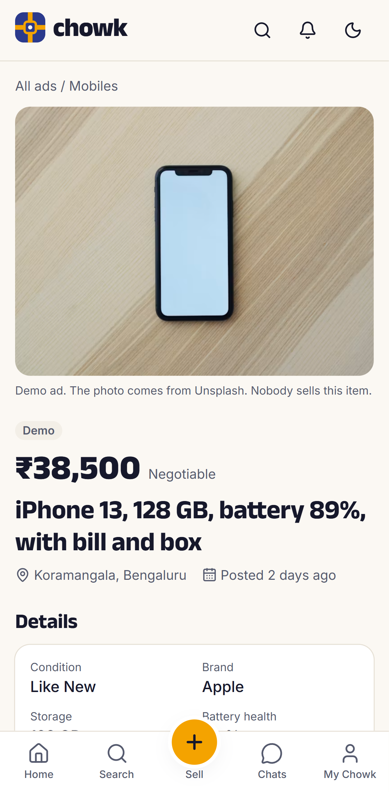
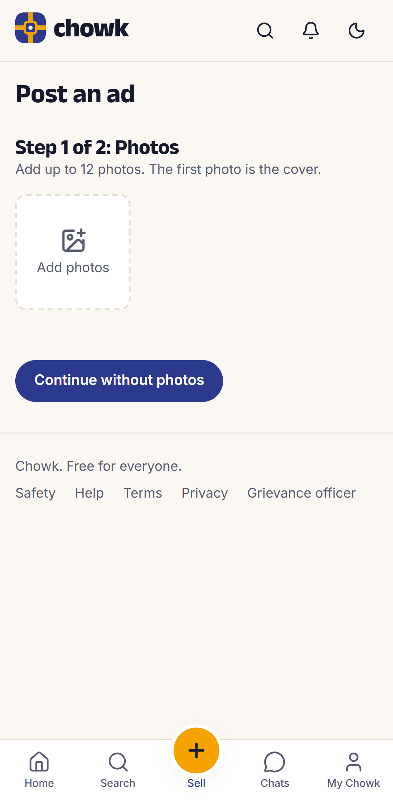
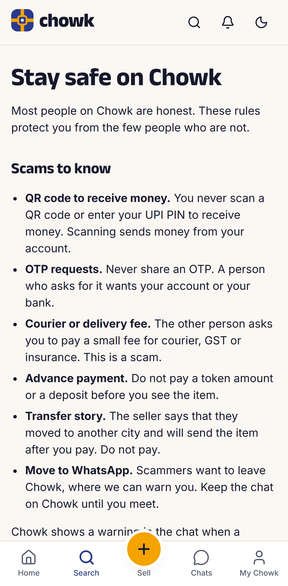
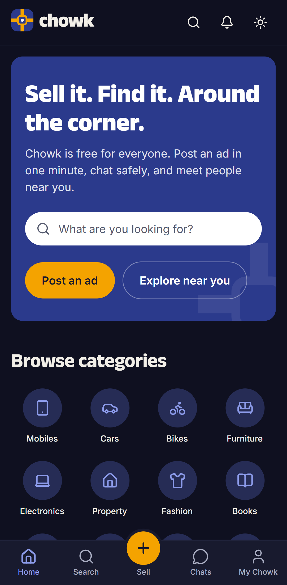
</p>

## How it works

### System

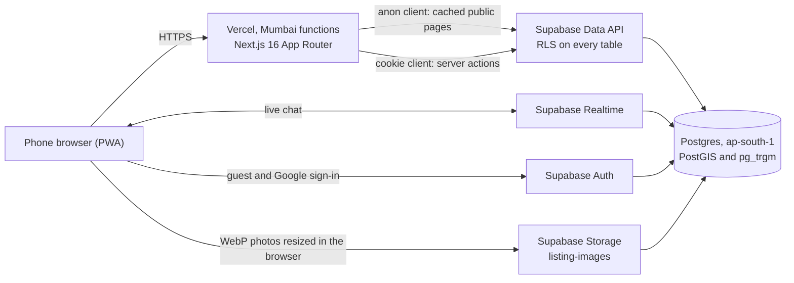

### From post to sale

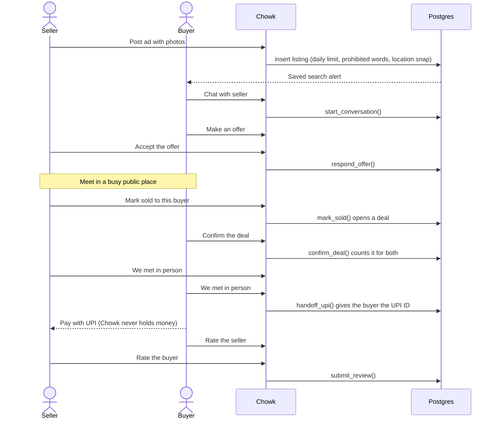

### Search

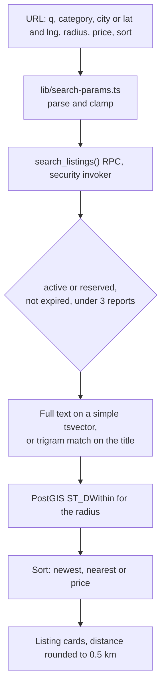

### Data model

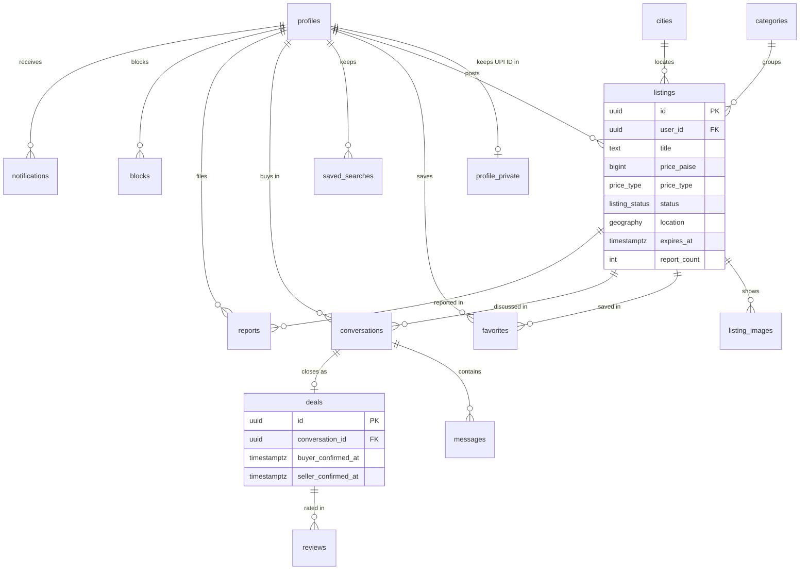

### Life of an ad

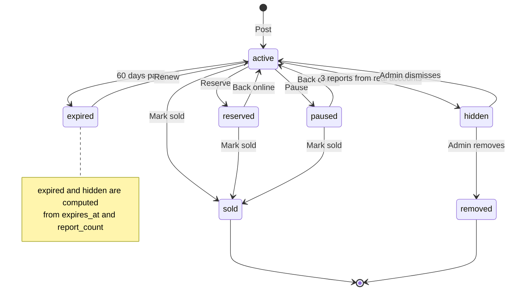

### Life of a deal

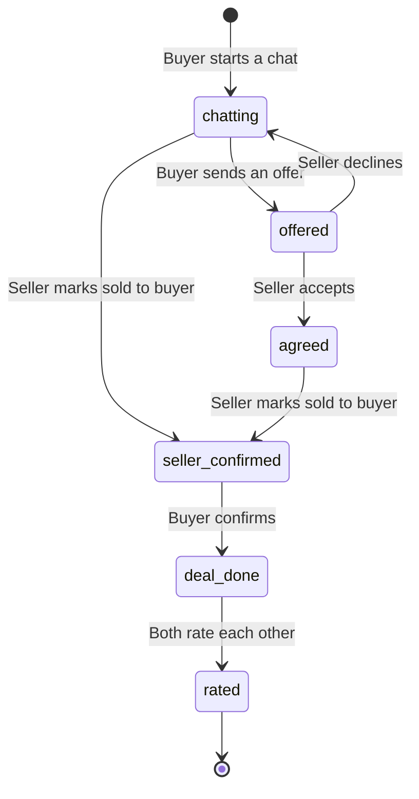

## Security model

- **Row level security on every table.** Pages and server actions query as the user. The app has no service role key.
- **Column grants.** Clients can write only the columns a person may change. `report_count`, `bumped_at`, `expires_at`, deal flags and `profiles.role` change only inside database functions.
- **Definer functions check the caller.** Each one sets `search_path = ''` and checks that the caller owns the ad or is part of the chat or deal. Trigger functions cannot be called from the API.
- **Chats.** Only the buyer and the seller read a chat. A block stops messages both ways. Clients cannot post system messages or notifications.
- **UPI handoff.** `handoff_upi()` returns the seller's UPI ID only to the buyer, and only after both tapped "We met in person".
- **Abuse limits.** 10 ads and 20 new chats per account per day, with a per-user lock. Guest reports do not hide ads.
- **Photos.** Uploads go only into the uploader's own storage folder.
- **Redirects.** The sign-in callback accepts only paths on Chowk.

`supabase/tests/rls.sql` proves these rules with 40 checks in one rolled-back transaction. `supabase/ADVISORS.md` lists every Supabase advisor warning and why it stays.

## Tech stack

| Part | Choice |
|---|---|
| App | Next.js 16 App Router, React 19, TypeScript, Tailwind CSS 4 |
| Data | Supabase Postgres in Mumbai with PostGIS, pg_trgm, RLS, Realtime, Storage and Auth |
| Hosting | Vercel, functions in `bom1` |
| Validation | Zod on every server action |
| Tests | Vitest (106 unit tests), Playwright (15 end-to-end tests), SQL RLS checks |

## Quality

Measured on production with Lighthouse 12, mobile, median of 3 runs:

| Page | Performance | Accessibility | Best practices |
|---|---|---|---|
| Home | 91 | 100 | 100 |
| Search | 82 | 100 | 100 |
| Ad page | 87 | 100 | 100 |

The largest paint on search and ad pages is a demo photo from Unsplash. Vercel marks `*.vercel.app` team URLs as `noindex`, so the SEO score stays at 66 until Chowk has its own domain. Every other SEO check passes.

## Run it yourself

1. Create a Supabase project, preferably in `ap-south-1`.
2. Apply the files in `supabase/migrations` in order, then run `supabase/seed/01_reference.sql` for categories, cities and the demo seller.
3. In Supabase, go to **Authentication → Sign In / Providers**. Turn on **Allow anonymous sign-ins** and **Allow manual linking**. Add Google if you want accounts that last across devices.
4. Copy `.env.example` to `.env.local` and fill in the values.
5. Install and start:

```bash
npm install
```

```bash
npm run dev
```

### Environment

| Variable | Use |
|---|---|
| `NEXT_PUBLIC_SUPABASE_URL` | Supabase project URL |
| `NEXT_PUBLIC_SUPABASE_PUBLISHABLE_KEY` | Publishable key. Safe in the browser because RLS protects the data. |
| `NEXT_PUBLIC_SITE_URL` | Public base URL for sign-in redirects, the sitemap and share links |

### Checks

```bash
npm run check
```

This runs the color contrast check, typecheck, lint, unit tests and the production build.

```bash
npx playwright test
```

End-to-end tests use your installed Chrome. Set `E2E_BASE_URL` to test a deployment. Tests that post ads, chat and delete their data run only with `E2E_WRITES=1`.

Run `supabase/tests/rls.sql` in the Supabase SQL editor. It ends with `RLS OK: 40 checks passed`, and nothing is kept.

## Release 2

- Web push alerts, then email after Chowk has a sending domain
- Photos in chat
- Hindi and Telugu
- Phone OTP and optional ID checks
- PIN code search with a full geocoder
- Its own domain, so search engines can index the ads
- A native app on the same backend

Chowk stays free. There is no escrow and no paid boost in any release.

## Contributing and security

Read [CONTRIBUTING.md](CONTRIBUTING.md) before you open a pull request. Report security problems as [SECURITY.md](SECURITY.md) describes, not in a public issue.

## License

[Apache License 2.0](LICENSE)
