<div align="center">


# Chowk

**Sell it. Find it. Around the corner.**

A free marketplace for India where anyone can sell, give away, swap or ask for things near them.

[](https://chowk-kandula.vercel.app)
[](https://github.com/kandulanikhilvarma/chowk/actions/workflows/ci.yml)
[](https://nextjs.org)
[](https://supabase.com)
[](LICENSE)

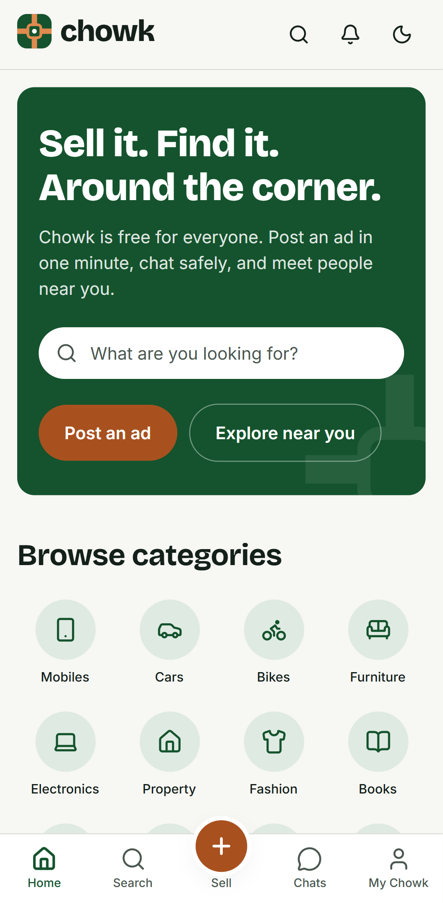
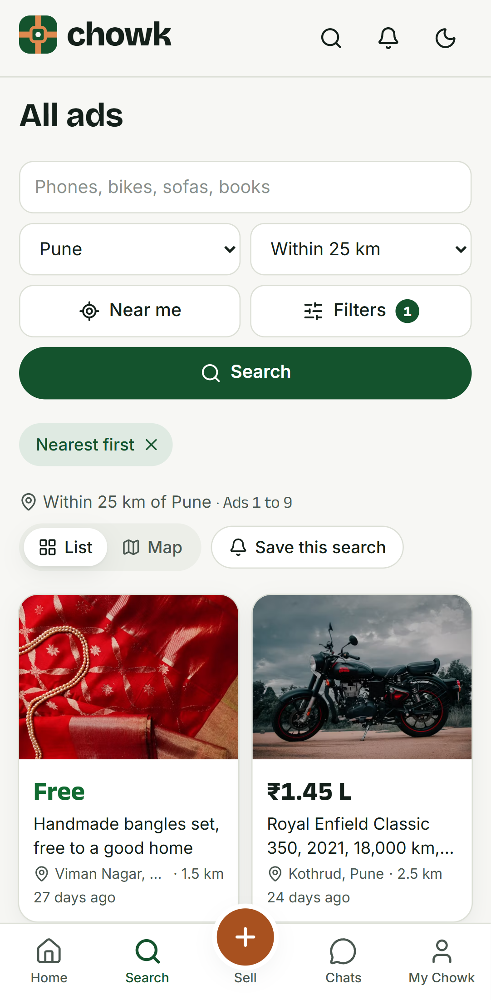
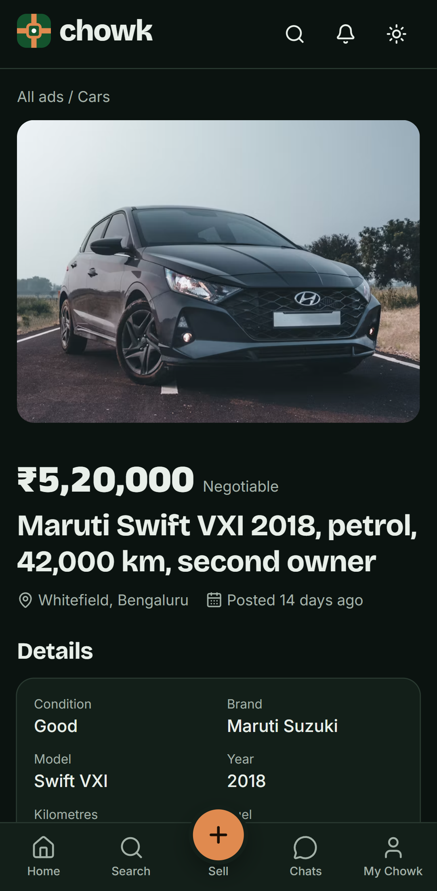

</div>

## Why Chowk

India has general classifieds and many vertical apps. People still meet the same problems. Fake buyers, "courier fee" and UPI QR scams are common. City-wide results ignore how far away an item is.

Germany's Kleinanzeigen shows another model. It has free ads, radius search, wanted ads and saved-search alerts. People give things away, and trust badges come only from real deals. Chowk brings that model to India and adds safety features for Indian payment scams.

- **Free for everyone.** No listing fees, no paid boosts, no commission. Chowk never holds money.
- **Near you.** Radius search from 2 to 100 km around a city or your location, sorted nearest first, as a list or on a map.
- **Safe by default.** Scam warnings inside the chat, a UPI pay link only after both people meet, and reports and blocks.
- **Trust you can see.** Friendly and reliable badges from confirmed deals, and how fast a seller replies. Guest ratings do not count.

## Screens

| Home | Search | Map | Ad page |
|---|---|---|---|
|  |  | 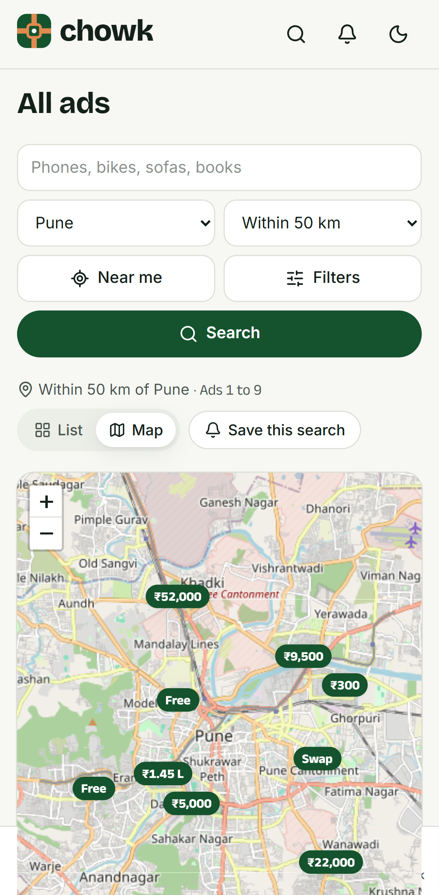 | 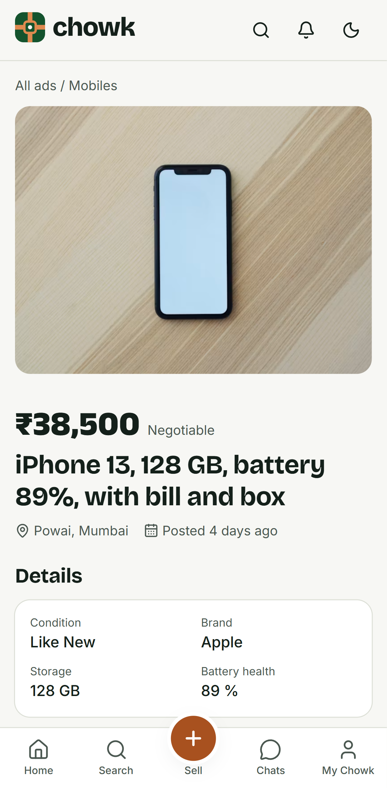 |
| Categories come from the database. Recently viewed ads stay on the device. | Main filters stay in view. The rest open in a sheet. Active filters show as chips you can remove. | Price pins on the area of each ad, rounded to about 500 m. | Swipe photos, open them full screen, see how fast the seller replies, and find similar ads. |

| Post an ad | Safety | Home, dark | Ad page, dark |
|---|---|---|---|
| 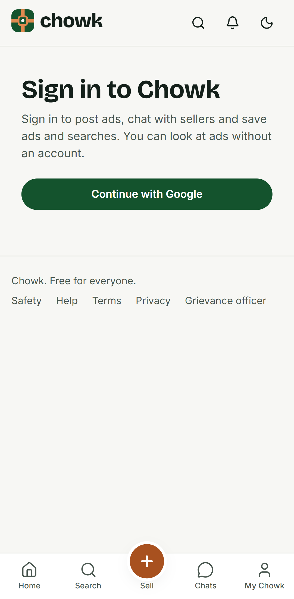 | 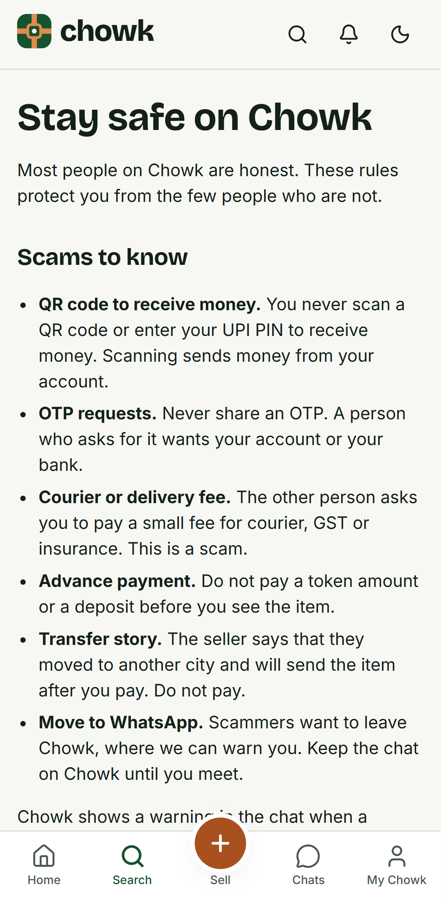 | 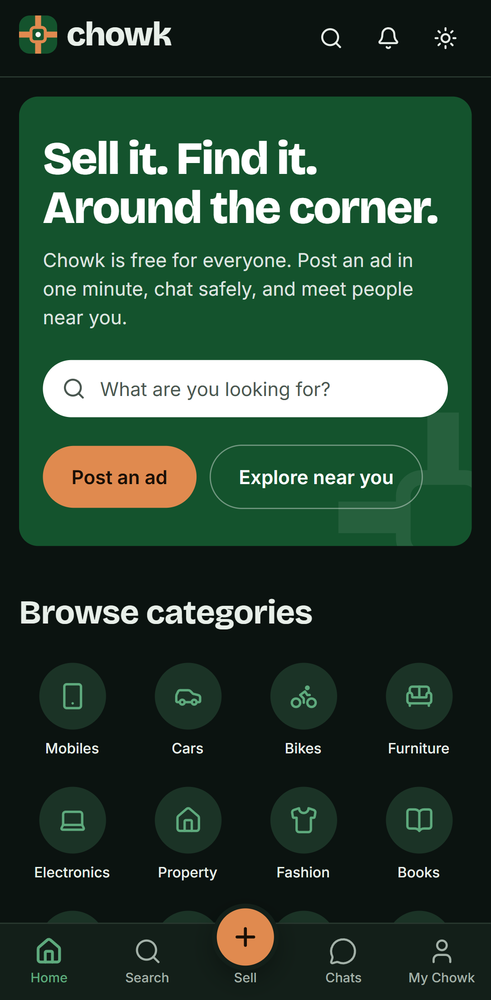 |  |
| Photos first, then details. The draft saves on the device. | The scams we warn about, in plain words. | Every colour has a light and a dark value. | Cards lift with a light edge, because a dark page hides shadows. |

`node scripts/screens.mjs http://localhost:3000` makes these pictures again from a running app.

## Features

### Kleinanzeigen parity

| Kleinanzeigen | Chowk |
|---|---|
| Anzeige aufgeben | Post in 2 steps: photos first (up to 12), then details. The draft saves on the device. |
| Angebot and Gesuch | Offer and Wanted ads |
| Festpreis, VB, Zu verschenken, Tauschen | Fixed, Negotiable, Free and Swap prices |
| Categories and filters | 12 categories with their own fields. Phones have storage. Cars have km, fuel and RC number. Filters for price, posted within, private or business seller, and ads with photos. |
| Umkreissuche | Radius search around a city or "Near me", nearest first. Browse starts at your last city, or at the city of your internet connection. |
| Kartenansicht | Map view of the results |
| Suchauftrag | Saved searches with an alert when a new ad matches |
| Merkliste | Watchlist with price drop alerts. Cards show the old price struck through. |
| Nachrichten | Live chat per ad with photos, quick replies, typing and online state, and unread counts |
| Preisvorschlag | Offers that the seller accepts or declines |
| Reserviert, Verkauft, Pausieren | Reserve, pause, mark sold, renew after 60 days, move up. Renew or pause all your ads at once. |
| Bewertungen and Abzeichen | Ratings after a confirmed deal, badges at 1, 3 and 6 raters, levels Newcomer, Trusted and Regular. A higher level gives more active ads (20, 50, 100) and a shorter wait to move an ad up. |
| Urlaubsmodus | Away mode. Your ads stay up, and buyers see the date you are back. |
| Melden and Blockieren | Report ads and people, block people, admin report queue and overview |

### For India

- Prices in rupees with Indian grouping (₹1,45,000, ₹4.5 L, ₹1.2 Cr), in even-width figures so a grid of prices lines up.
- Scam detector in chat. It warns about OTP requests, "scan QR to receive money" and courier fees. It also warns about advance payments, UPI collect requests and moves to WhatsApp.
- Prohibited item check at post time: weapons, drugs, protected wildlife, prescription medicine, fake goods.
- Phone ads link to Sanchar Saathi for an IMEI check. Car and bike ads check the RC number format and link to Parivahan.
- Place privacy. The database moves every ad to the center of a square of about 500 m. Distances show rounded to 0.5 km, and map pins sit on that square, never on the seller's spot.
- Share button on every ad. It opens the phone's share sheet, or WhatsApp where there is none, with a share picture that shows the photo, price, title and place.
- Terms and a privacy policy for the DPDP Act 2023. A grievance officer page for the IT Rules 2021. Data export and account delete.

### Finding things

- Search suggestions as you type: your recent searches from this device, then live ad titles, with typos allowed ("swfit" finds the Swift).
- Similar ads on every ad page, nearest first, and more ads from the same seller. A sold ad is never a dead end.
- Recently viewed ads on the home page. The list stays on the device and never reaches the server.

### Low friction, no dark patterns

- Browse without an account. Posting, chatting, saving and reporting need Google sign-in, and sign-in brings you back to the same page.
- Installs as an app. A service worker caches the shell, so a dropped connection shows an offline page instead of a browser error.
- Sell is the center tab. A strength meter, a category suggestion and a price hint help. A first ad goes online in about a minute.
- Safety nudges show at the moment of risk: the first chat with a stranger, and payment words in a message.
- No streaks, no fake urgency, no paid placement.

## Design system

All tokens live in `app/globals.css`. Each token holds its light and its dark value in one place. `scripts/contrast.mjs` reads them and fails the build when a text pair misses WCAG AA (38 pairs today).

| Token | Use |
|---|---|
| `--primary` (forest) | Every primary action |
| `--accent` (copper), `--accent-hover` | One call to action per screen: Post an ad |
| `--warning` (amber) | States that wait: Reserved, Away, Hidden from search |
| `--success`, `--danger` | Free, Sold, deal done; errors and live scam warnings |
| `--card-shadow`, `--lift-shadow` | A tinted shadow in light mode; a faint light edge in dark mode |

| Font | Use |
|---|---|
| Bricolage Grotesque (optical size axis) | Headings. The hero line grows from 36 px to 64 px with the screen. |
| Inter | Body text |
| Anek Latin, tabular figures | Prices |

Motion is short and has a reason. Every rule below turns off or becomes a plain fade with reduced motion.

| Moment | Motion |
|---|---|
| Card to ad page | The card photo moves into the gallery (React `<ViewTransition>`) |
| Card hover | The card lifts 2 px, the photo zooms 4 %, the title turns forest |
| Filters | A bottom sheet slides up on a phone and fades in on a desktop |
| Save to watchlist | The heart pops once and fills at once, before the server answers |
| Chat | New messages rise in, a typing indicator, an accepted offer gets a green ring |
| Deal done | A check mark draws itself |

## How it works

### System

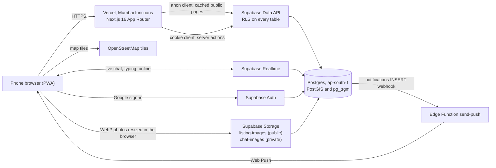
```mermaid
flowchart LR
  U["Phone browser (PWA)"] -->|HTTPS| V["Vercel, Mumbai functions<br/>Next.js 16 App Router"]
  V -->|"anon client: cached public pages"| API["Supabase Data API<br/>RLS on every table"]
  V -->|"cookie client: server actions"| API
  U -->|"Google sign-in"| AUTH["Supabase Auth"]
  U -->|"WebP photos resized in the browser"| ST["Supabase Storage<br/>listing-images (public)<br/>chat-images (private)"]
  U <-->|"live chat, typing, online"| RT["Supabase Realtime"]
  U -->|"map tiles"| OSM["OpenStreetMap tiles"]
  API --> DB[("Postgres, ap-south-1<br/>PostGIS and pg_trgm")]
  RT --> DB
  AUTH --> DB
  ST --> DB
  DB -->|"notifications INSERT webhook"| EF["Edge Function send-push"]
  EF -->|"Web Push"| U
```

### A request

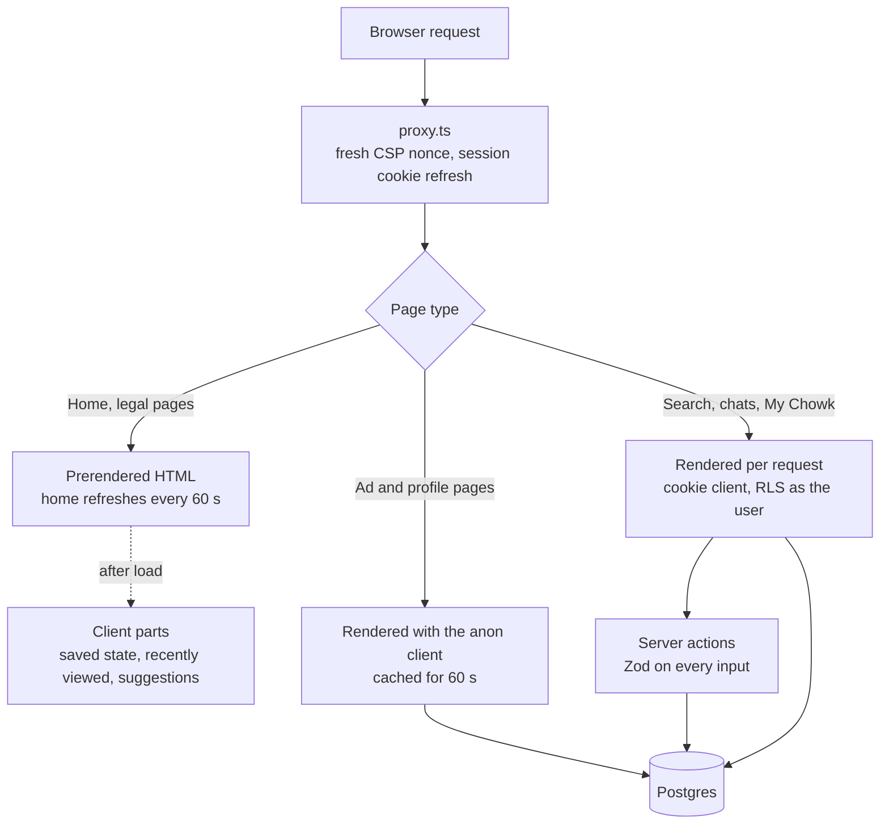
```mermaid
flowchart TD
  R["Browser request"] --> P["proxy.ts<br/>fresh CSP nonce, session cookie refresh"]
  P --> K{"Page type"}
  K -->|"Home, legal pages"| S["Prerendered HTML<br/>home refreshes every 60 s"]
  K -->|"Ad and profile pages"| C["Rendered with the anon client<br/>cached for 60 s"]
  K -->|"Search, chats, My Chowk"| D["Rendered per request<br/>cookie client, RLS as the user"]
  D --> A["Server actions<br/>Zod on every input"]
  C --> PG[("Postgres")]
  D --> PG
  A --> PG
  S -.->|"after load"| CL["Client parts<br/>saved state, recently viewed, suggestions"]
```

### From post to sale

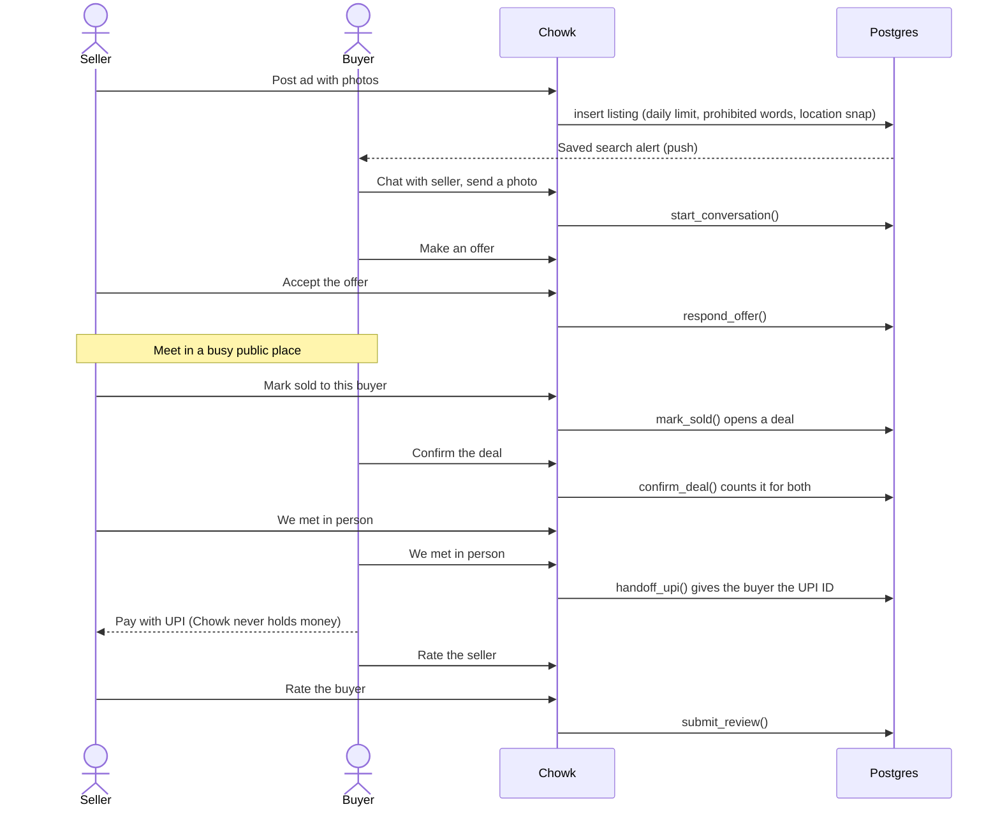
```mermaid
sequenceDiagram
  actor S as Seller
  actor B as Buyer
  participant C as Chowk
  participant DB as Postgres
  S->>C: Post ad with photos
  C->>DB: insert listing (daily limit, prohibited words, location snap)
  DB-->>B: Saved search alert (push)
  B->>C: Chat with seller, send a photo
  C->>DB: start_conversation()
  B->>C: Make an offer
  S->>C: Accept the offer
  C->>DB: respond_offer()
  Note over S,B: Meet in a busy public place
  S->>C: Mark sold to this buyer
  C->>DB: mark_sold() opens a deal
  B->>C: Confirm the deal
  C->>DB: confirm_deal() counts it for both
  S->>C: We met in person
  B->>C: We met in person
  C->>DB: handoff_upi() gives the buyer the UPI ID
  B-->>S: Pay with UPI (Chowk never holds money)
  B->>C: Rate the seller
  S->>C: Rate the buyer
  C->>DB: submit_review()
```

### Search

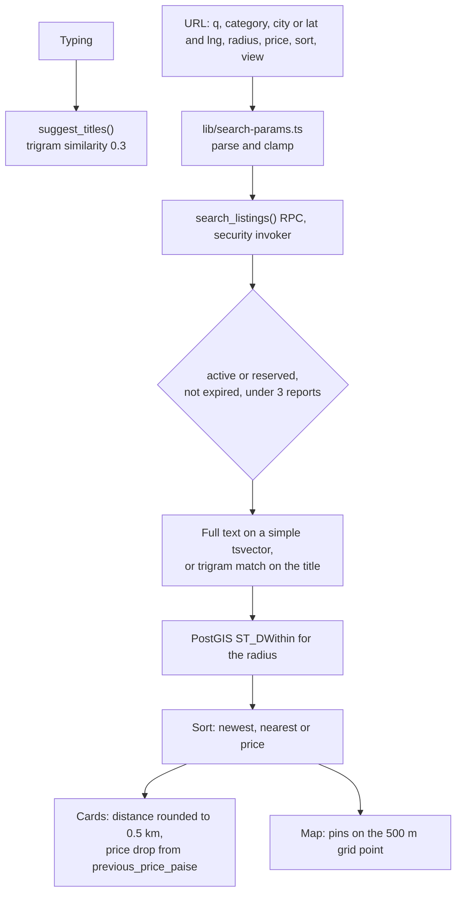
```mermaid
flowchart TD
  T["Typing"] --> SG["suggest_titles()<br/>trigram similarity 0.3"]
  Q["URL: q, category, city or lat and lng, radius, price, sort, view"] --> P["lib/search-params.ts<br/>parse and clamp"]
  P --> R["search_listings() RPC, security invoker"]
  R --> F1{"active or reserved,<br/>not expired, under 3 reports"}
  F1 --> F2["Full text on a simple tsvector,<br/>or trigram match on the title"]
  F2 --> F3["PostGIS ST_DWithin for the radius"]
  F3 --> S["Sort: newest, nearest or price"]
  S --> C["Cards: distance rounded to 0.5 km,<br/>price drop from previous_price_paise"]
  S --> M["Map: pins on the 500 m grid point"]
```

### Data model

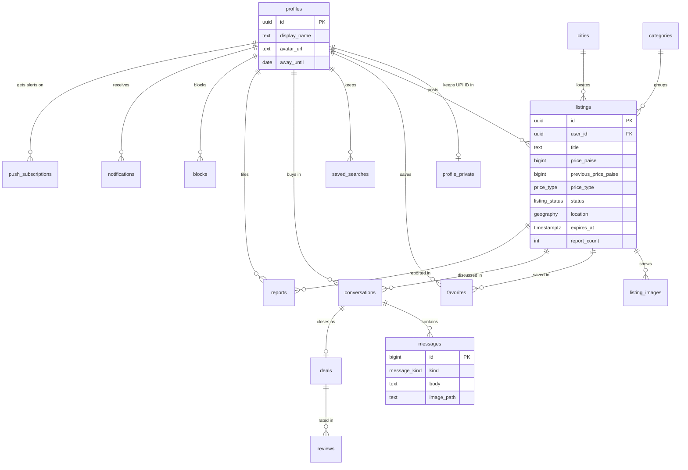
```mermaid
erDiagram
  profiles ||--o| profile_private : "keeps UPI ID in"
  profiles ||--o{ listings : posts
  categories ||--o{ listings : groups
  cities ||--o{ listings : locates
  listings ||--o{ listing_images : shows
  profiles ||--o{ favorites : saves
  listings ||--o{ favorites : "saved in"
  profiles ||--o{ saved_searches : keeps
  listings ||--o{ conversations : "discussed in"
  profiles ||--o{ conversations : "buys in"
  conversations ||--o{ messages : contains
  conversations ||--o| deals : "closes as"
  deals ||--o{ reviews : "rated in"
  profiles ||--o{ reports : files
  listings ||--o{ reports : "reported in"
  profiles ||--o{ blocks : blocks
  profiles ||--o{ notifications : receives
  profiles ||--o{ push_subscriptions : "gets alerts on"
  listings {
    uuid id PK
    uuid user_id FK
    text title
    bigint price_paise
    bigint previous_price_paise
    price_type price_type
    listing_status status
    geography location
    timestamptz expires_at
    int report_count
  }
  messages {
    bigint id PK
    message_kind kind
    text body
    text image_path
  }
  profiles {
    uuid id PK
    text display_name
    text avatar_url
    date away_until
  }
```

### Life of an ad

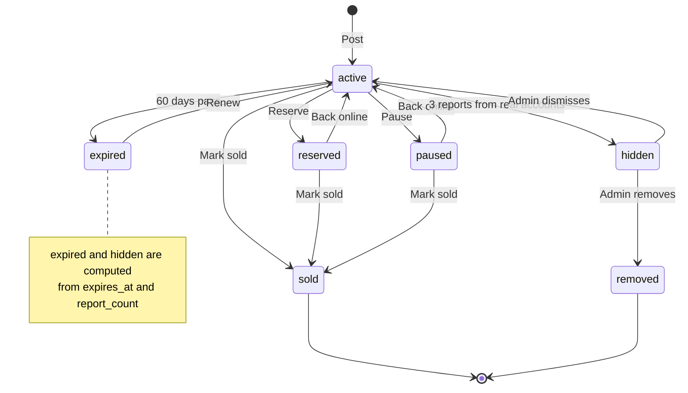
```mermaid
stateDiagram-v2
  [*] --> active: Post
  active --> reserved: Reserve
  reserved --> active: Back online
  active --> paused: Pause
  paused --> active: Back online
  active --> sold: Mark sold
  reserved --> sold: Mark sold
  paused --> sold: Mark sold
  active --> expired: 60 days pass
  expired --> active: Renew
  active --> hidden: 3 reports from real accounts
  hidden --> active: Admin dismisses
  hidden --> removed: Admin removes
  sold --> [*]
  removed --> [*]
  note right of expired
    expired and hidden are computed
    from expires_at and report_count
  end note
```

### Life of a deal

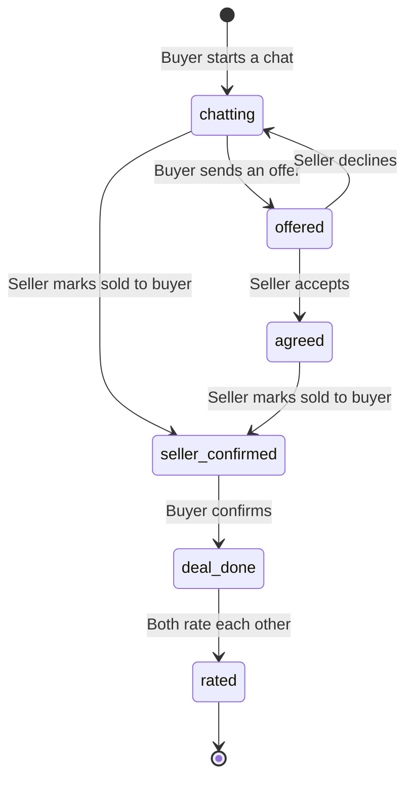
```mermaid
stateDiagram-v2
  [*] --> chatting: Buyer starts a chat
  chatting --> offered: Buyer sends an offer
  offered --> chatting: Seller declines
  offered --> agreed: Seller accepts
  chatting --> seller_confirmed: Seller marks sold to buyer
  agreed --> seller_confirmed: Seller marks sold to buyer
  seller_confirmed --> deal_done: Buyer confirms
  deal_done --> rated: Both rate each other
  rated --> [*]
```

## Project structure

```text
app/                    Routes (Next.js App Router)
  page.tsx              Home: categories, fresh and free ads, recently viewed
  s/, c/[slug]/         Search and category pages (one SearchView)
  l/[id]/               Ad page, edit page, share picture
  messages/             Chat list and chat room
  me/                   My ads, watchlist, saved searches, settings, data export
  admin/                Overview and report queue (admins only)
  api/health/           Uptime check
components/
  listing/              Cards, rails, gallery, filter sheet, map, post form
  chat/                 Chat room and ad strip
  shell/                Header, bottom nav, search box with suggestions
  ui/                   Button, badge, chip, avatar, skeleton, empty state
lib/                    Formatting, search params, Supabase clients, local lists
supabase/
  migrations/           Every schema change, in order
  functions/send-push/  Edge Function that sends web push alerts
  tests/rls.sql         62 security and business rule checks
tests/unit/, tests/e2e/ Vitest and Playwright
scripts/                Contrast check and README screenshots
instrumentation.ts      Server error reporting
proxy.ts                Content Security Policy and session refresh
```

## Security model

- **Row level security on every table.** Pages and server actions query as the user. The app has no service role key. Only the push Edge Function uses one, inside Supabase.
- **Column grants.** Clients can write only the columns that a person can change. `report_count`, `bumped_at`, `expires_at`, `previous_price_paise`, deal flags and `profiles.role` change only inside database functions.
- **Definer functions check the caller.** Each one sets `search_path = ''` and checks that the caller owns the ad or is part of the chat or deal. The API cannot call trigger functions. `admin_overview()` refuses everyone but an admin.
- **Chats.** Only the buyer and the seller read a chat. A block stops messages both ways. Clients cannot post system messages or notifications. Typing and online signals carry a user id only, never message text.
- **Chat photos.** A private bucket. Only the two people in the chat can upload into or read from the chat's folder, and the page shows photos through links that expire after one hour.
- **UPI handoff.** `handoff_upi()` returns the seller's UPI ID only to the buyer, and only after both tapped "We met in person".
- **Signed-in writes only.** Restrictive RLS policies refuse posts, photos, chats, messages, saves and reports from guest (anonymous) sessions, so the API cannot skip the sign-in wall.
- **Abuse limits.** 10 ads and 20 new chats per account per day, with a per-user lock.
- **Photos.** Ad photo uploads go only into the uploader's own storage folder.
- **Redirects.** The sign-in callback accepts only paths on Chowk.
- **Content Security Policy.** Every dynamically rendered page carries `script-src 'self' 'nonce-...' 'strict-dynamic'`, so an injected `<script>` cannot run. The one inline script, the theme switch, is allowed by its SHA-256 hash instead of a nonce, which keeps the home page and the legal pages prerendered. `tests/unit/csp.test.ts` recomputes that hash and checks the prerendered list against `.next/prerender-manifest.json`. Images load only from Chowk, Supabase, Unsplash (demo ads), Google profile photos and OpenStreetMap tiles.
- **Map privacy.** Map pins use the same 500 m grid point as distances. Popups are built from DOM text, so an ad title cannot inject HTML.

`supabase/tests/rls.sql` proves these rules with 62 checks in one rolled-back transaction. `supabase/ADVISORS.md` lists every Supabase advisor warning and why it stays.

## Tech stack

| Part | Choice |
|---|---|
| App | Next.js 16 App Router, React 19, TypeScript, Tailwind CSS 4 |
| Data | Supabase Postgres in Mumbai with PostGIS, pg_trgm, RLS, Realtime, Storage, Auth and Edge Functions |
| Map | Leaflet with OpenStreetMap tiles, loaded only on the map view |
| Hosting | Vercel, functions in `bom1`, Vercel Web Analytics (no cookies) |
| Validation | Zod on every server action |
| Tests | Vitest (117 unit tests), Playwright (21 end-to-end tests), SQL checks (62) |
| CI | GitHub Actions: contrast, types, lint, build, unit and end-to-end tests |

## Quality

Measured on production with Lighthouse 12, mobile, median of 3 runs, before Release 2. Run it again after the next deploy.

| Page | Performance | Accessibility | Best practices |
|---|---|---|---|
| Home | 91 | 100 | 100 |
| Search | 82 | 100 | 100 |
| Ad page | 87 | 100 | 100 |

The largest paint on search and ad pages is a demo photo from Unsplash. Vercel marks `*.vercel.app` team URLs as `noindex`, so the SEO score stays at 66 until Chowk has its own domain. Every other SEO check passes.

## Run it yourself

1. Create a Supabase project, preferably in `ap-south-1`.
2. Apply the files in `supabase/migrations` in order, then run `supabase/seed/01_reference.sql` for categories, cities and the demo seller.
3. In Supabase, go to **Authentication → Sign In / Providers**. Add Google. Turn off **Allow anonymous sign-ins**: the database refuses guest posts, chats, saves and reports.
4. Copy `.env.example` to `.env.local` and fill in the values.
5. Install and start:

```bash
npm install
```

```bash
npm run dev
```

### Deploy order

Apply new migrations before you deploy the code that uses them. The ad, chat and settings pages read columns that the Release 2 migrations add.

### Push alerts

1. Make a VAPID keypair:

```bash
npx web-push generate-vapid-keys
```

2. Put the public key in `NEXT_PUBLIC_VAPID_PUBLIC_KEY` on Vercel.
3. Give the Edge Function its secrets. `PUSH_WEBHOOK_SECRET` is any long random string. `VAPID_SUBJECT` is a `mailto:` or `https:` contact for the push services.

```bash
supabase secrets set VAPID_PUBLIC_KEY=... VAPID_PRIVATE_KEY=... VAPID_SUBJECT=mailto:you@example.com PUSH_WEBHOOK_SECRET=...
```

4. Deploy the function:

```bash
supabase functions deploy send-push --no-verify-jwt
```

5. In Supabase, go to **Database → Webhooks** and add one for `public.notifications`, event INSERT, that calls the `send-push` function with the HTTP header `x-push-secret` set to your `PUSH_WEBHOOK_SECRET`.

### Environment

| Variable | Use |
|---|---|
| `NEXT_PUBLIC_SUPABASE_URL` | Supabase project URL |
| `NEXT_PUBLIC_SUPABASE_PUBLISHABLE_KEY` | Publishable key. Safe in the browser because RLS protects the data. |
| `NEXT_PUBLIC_SITE_URL` | Public base URL for sign-in redirects, the sitemap and share links |
| `NEXT_PUBLIC_VAPID_PUBLIC_KEY` | Public half of the web push keypair. Leave it blank and the alerts opt-in stays hidden. |
| `ERROR_WEBHOOK_URL` | Optional. A Slack, Discord or alerting webhook that gets one message per server error. |

### Checks

```bash
npm run check
```

This runs the color contrast check, typecheck, lint, unit tests and the production build. CI runs the same steps on every push, then the end-to-end tests. CI needs the repository secrets `NEXT_PUBLIC_SUPABASE_URL` and `NEXT_PUBLIC_SUPABASE_PUBLISHABLE_KEY`.

```bash
npx playwright test
```

End-to-end tests use your installed Chrome. Set `E2E_BASE_URL` to test a deployment. Tests that post ads, chat and delete their data run only with `E2E_WRITES=1`. They sign in as two test accounts. Make both in Supabase (Authentication, Users, Add user, with auto confirm). Put `E2E_SELLER_EMAIL`, `E2E_SELLER_PASSWORD`, `E2E_BUYER_EMAIL` and `E2E_BUYER_PASSWORD` in `.env.local`.

Run `supabase/tests/rls.sql` in the Supabase SQL editor. It ends with `RLS OK: 62 checks passed`, and nothing is kept.

## Operations

| What | Where |
|---|---|
| Uptime | `GET /api/health` returns 200 with the database time, or 503. Point a free uptime monitor at it. |
| Server errors | One JSON line per error in the Vercel logs, with the digest the error page shows. `ERROR_WEBHOOK_URL` adds a ping. |
| Usage | Vercel Web Analytics. Turn it on in the Vercel project. It sets no cookies. |
| Moderation | `/admin` shows new ads, chats, deals, members and open reports. `/admin/reports` is the queue. |
| Health of the market | Watch deals per ad online on `/admin`. More ads with no more deals means buyers do not find what they want. |

## Troubleshooting

| Problem | Fix |
|---|---|
| Every page shows an error, and `/api/health` returns 503 | The Supabase free tier pauses an idle project. Restore it in the Supabase dashboard. |
| Google sign-in returns to the wrong site | Add your site URL and `/auth/callback` under Authentication → URL Configuration. |
| The alerts switch does not show | `NEXT_PUBLIC_VAPID_PUBLIC_KEY` is blank, or the browser has no push support. |
| Alerts are on but nothing arrives | Check the webhook header, the function secrets, and the function logs in Supabase. |
| An ad page fails after a deploy | A migration is missing. Apply every file in `supabase/migrations`. |

## Roadmap

| Item | Status |
|---|---|
| Web push alerts | Code ready. Needs the VAPID keys, the function deploy and the webhook above. |
| Photos in chat | Done |
| Map view, search suggestions, similar ads, recently viewed | Done |
| Away mode, bulk actions in My ads, admin overview | Done |
| Hindi and Telugu, with Anek Devanagari and Anek Telugu for the matching figures | Planned |
| Email alerts, once Chowk has a sending domain | Planned |
| Its own domain, so search engines can index the ads | Planned |
| Demo photos hosted in Supabase Storage instead of Unsplash | Planned |
| Phone OTP and optional ID checks | Planned |
| PIN code search with a full geocoder | Planned |
| A native app on the same backend | Planned |

Chowk stays free. There is no escrow and no paid boost in any release.

## Contributing and security

Read [CONTRIBUTING.md](CONTRIBUTING.md) before you open a pull request. Report security problems as [SECURITY.md](SECURITY.md) describes, not in a public issue.

## License

[Apache License 2.0](LICENSE)
